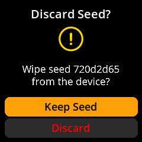
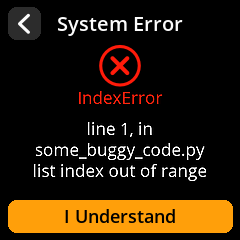

# SeedSigner User Guide

  

SeedSigner is an air-gapped, open-source Bitcoin signing device that helps you manage seed phrases and sign transactions securely. This guide provides step-by-step instructions organized by common workflows.

## 📋 Table of Contents

- [Hardware Components](#hardware-components)
- [Getting Started](#-getting-started)
- [Creating New Seeds](#-creating-new-seeds)
- [Loading Existing Seeds](#-loading-existing-seeds)
- [Working with Loaded Seeds](#-working-with-loaded-seeds)
- [Signing Transactions](#️-signing-transactions)
- [Verification and Security](#️-verification-and-security)
- [Device Settings](#️-device-settings)
- [Troubleshooting](#-troubleshooting)
- [Additional Resources](#-additional-resources)

---

## Hardware Components

A SeedSigner device consists of:

1. **Raspberry Pi Zero** - The main computing unit
2. **Raspberry Pi Camera** - For QR code scanning and entropy capture
3. **WaveShare 1.3inch LCD Hat** - Display and control interface

### WaveShare LCD Hat Controls

  

The WaveShare LCD Hat provides the following controls:

- **Joystick**: Four-directional navigation (Up, Down, Left, Right) plus center press
- **Key1 (A)**: Primary action button
- **Key2 (B)**: Secondary action button  
- **Key3 (C)**: Tertiary action button

### Button Functions Reference

| Control        | Function                                    |
| -------------- | ------------------------------------------- |
| Joystick Up    | Move selection up                           |
| Joystick Down  | Move selection down                         |
| Joystick Left  | Move selection left                         |
| Joystick Right | Move selection right                        |
| Joystick Press | Alternative selection/confirm (context-dependent) |
| Key1 (A)       | Select highlighted option or confirm action |
| Key2 (B)       | Select highlighted option or confirm action |
| Key3 (C)       | Select highlighted option or confirm action |

**Important Navigation Notes**: 
- All three keys (A, B, C) function identically for selection and confirmation
- To go back to a previous screen, navigate to the back arrow/button using the joystick first, then press any key to activate it
- The joystick center press may have different functions depending on the current screen context

---

## 🚀 Getting Started

### Initial Setup and Power On

#### Starting Your Device

1. **Connect Power**: Use a Micro USB cable to power your SeedSigner
2. **Wait for Boot**: Wait for few seconds for the complete boot sequence
3. **Dismiss Initial Notification**: Press any key (A, B, or C) to dismiss the "You can remove the SD card now" message

     

> **💡 Pro Tip**: Once the operating system loads into RAM, you can safely remove the SD card. This ensures that seed phrases cannot be accidentally stored on the device, maintaining air-gapped security.

#### Navigation Basics

- Use the **joystick** to highlight menu options
- Press **any key (A, B, or C)** to select the highlighted option
- Look for **back arrows** or **"Back" buttons** to return to previous screens
- The **power icon** in the top-right corner provides power options

#### Powering Off Safely

**Method 1: Proper Shutdown**
1. Navigate to the **power icon** (top right of main menu)
2. Press any key to open the power menu
3. Select **"Power Off"** and confirm your choice

     

**Method 2: Direct Unplugging**
You can safely unplug the device at any time. SeedSigner stores nothing permanently, so all sensitive data is automatically cleared when power is removed.

---

## 🌱 Creating New Seeds

### Camera-Based Seed Generation

Create truly random seeds using environmental entropy captured by the camera. This method provides excellent randomness by capturing unpredictable visual data.

#### Step-by-Step Process

1. **Navigate**: Main Menu → **Seeds** → **"Load a Seed"** → **"Create a seed"**
2. **Select Method**: Choose **"New Seed"** with the camera icon
3. **Capture Entropy**: 
   - Point the camera at a random, changing scene (moving trees, clouds, etc.)
   - Press any key to capture the entropy
4. **Review Capture**: 
   - Move joystick **left** to retake the photo
   - Move joystick **right** to continue with current capture
5. **Choose Length**: Select **12 words** or **24 words** (24 words recommended for maximum security)
6. **Acknowledge Security Warning**: Press **"I Understand"** after reading the classified information warning
7. **Record Your Seed Words**: 
   - Words are displayed 4 at a time
   - **Write down every word carefully** in the exact order shown
   - Double-check each word as you write it
8. **Verify Your Backup**: Complete the verification process to confirm you've recorded everything correctly

     

     

> **⚠️ Critical Security Warning**: If you write down even one word incorrectly, you could lose access to your Bitcoin forever. The verification step is mandatory - never skip it!

### Dice-Based Seed Generation

Generate seeds using physical dice for maximum security and provable randomness. This method is preferred by security-conscious users who want complete control over the randomness source.

#### Step-by-Step Process

1. **Navigate**: Main Menu → **Seeds** → **"Load a Seed"** → **"Create a seed"**
2. **Select Method**: Choose **"New Seed"** with the dice icon
3. **Choose Length**: 
   - **12 words** requires 50 dice rolls
   - **24 words** requires 99 dice rolls (recommended)
4. **Prepare Physical Dice**: Use a standard 6-sided die
5. **Roll and Enter**: 
   - Roll your physical die
   - Select the corresponding number (1-6) on the screen
   - Repeat for all required rolls
6. **Complete All Rolls**: The progress indicator shows your completion status
7. **Record Generated Words**: Write down all seed words in order
8. **Verify Your Backup**: Complete the verification process

     

     

> **🎲 Why Use Dice?** Physical dice provide true randomness that cannot be compromised by software vulnerabilities, hardware backdoors, or electromagnetic interference. This method gives you complete control over the entropy source.

### Calculate Final Word (12th/24th Word)

Use this feature when you have an incomplete seed (11 out of 12 words, or 23 out of 24 words) and need to calculate the valid final word with proper checksum.

#### Basic Word Entry Process
1. **Navigate**: Main Menu → **Tools** → **"Calc 12th/24th word"**
2. **Choose Length**: Select **12 words** or **24 words**
3. **Enter Existing Words**: Use the on-screen keyboard with intelligent word suggestions:
   - **Key A**: Move up in the suggestions list
   - **Key C**: Move down in the suggestions list  
   - **Key B**: Select the highlighted suggested word
   - Type manually if the word doesn't appear in suggestions

     

#### Entropy Methods for Final Word Calculation

**🪙 Coin Flip Entropy Method**
- Flip a physical coin exactly 7 times
- For each flip, select **1 for Heads** or **0 for Tails**
- The system displays your binary string and calculates the checksum
- This provides additional randomness for the final word selection

     

**📝 Word Selection Entropy Method**
- Choose any word from the BIP39 wordlist as your entropy source
- The system calculates the final word using the selected word's 11-bit binary value plus the required 4-bit checksum

**🔢 Finalize with Zeros Method**
- Uses a simple 7-bit string of zeros plus the calculated 4-bit checksum
- This is the quickest method but provides no additional entropy

     

> **📚 Technical Note**: The final word in any BIP39 seed contains both entropy bits and checksum bits. The checksum ensures the seed phrase is mathematically valid and helps detect transcription errors.

---

## 📥 Loading Existing Seeds

### Manual Seed Entry

Enter your existing mnemonic phrase using the on-screen keyboard system.

#### Step-by-Step Process

1. **Navigate**: Main Menu → **Seeds** → **"Load a Seed"**
2. **Choose Length**: Select **"Enter 12-word seed"** or **"Enter 24-word seed"**
3. **Enter Each Word**: 
   - Use the on-screen keyboard with intelligent word suggestions
   - Type the first few letters and select from suggestions for faster entry
     - **Key A**: Move up in the suggestions list
     - **Key C**: Move down in the suggestions list  
     - **Key B**: Select the highlighted suggested word
   - Verify each word before proceeding to the next
4. **Review Seed Fingerprint**: Check the unique identifier on the "Finalize Seed" screen
5. **Complete Loading**: 
   - Select **"Done"** to load the seed as-is
   - Or select **"BIP-39 Passphrase"** to add an additional security layer

     

     

> **⚡ Speed Tip**: The word suggestion feature dramatically speeds up entry. Type just the first 2-3 letters of each word and select from the filtered suggestions rather than typing each letter individually.

### SeedQR Scanning

Quickly and securely load seeds from SeedQR codes - a compact QR code format specifically designed for seed phrases.

#### Step-by-Step Process

1. **Navigate**: Main Menu → **Scan**
2. **Position QR Code**: Point the camera at your SeedQR code
3. **Wait for Recognition**: The device will automatically detect and process valid SeedQR codes
4. **Review Details**: Check the seed information on the "Finalize Seed" screen
5. **Complete Loading**: Select **"Done"** to load the seed

     

> **❌ Troubleshooting**: If you see "Unknown QR Type", the QR code format isn't recognized as a valid SeedQR. Press "Done" to return to scanning mode and verify you're using a properly formatted SeedQR code.

### Adding BIP-39 Passphrase

Enhance your seed security with an optional passphrase. This creates an entirely different wallet even with the same seed words.

#### Step-by-Step Process

1. **Access Passphrase Entry**: From the "Finalize Seed" screen, select **"BIP-39 Passphrase"**
2. **Enter Your Passphrase**: Use the on-screen keyboard with multiple character sets:
   - **Default Mode**: Lowercase letters (a-z)
   - **Key A**: Switch to uppercase letters (A-Z)
   - **Key B**: Access numbers (0-9) and symbols (!@#$%^&*)
   - **Key C**: Confirm and finalize your passphrase
3. **Review Your Entry**: Double-check your passphrase for accuracy
4. **Confirm or Edit**: Select **"Done"** to confirm, or make corrections if needed

     

> **🔐 Critical Security Note**: A BIP-39 passphrase creates an entirely different wallet from the same seed words. You must store your passphrase separately from your seed words. Losing the passphrase means losing access to that wallet forever.

---

## 🔧 Working with Loaded Seeds

### Export Public Key (Xpub)

Create watch-only wallets in your favorite Bitcoin software by exporting your public key. This allows you to monitor balances and prepare transactions without exposing your private keys.

#### Step-by-Step Process

1. **Access Export**: From the seed's main screen, select **"Export Xpub"**
2. **Choose Signature Type**: 
   - **"Single Sig"** - For standard personal wallets
   - **"Multisig"** - For multi-signature wallets requiring multiple devices
3. **Select Script Type**:
   - **Native Segwit** (bech32) - Recommended for lowest fees
   - **Nested Segwit** (P2SH) - For compatibility with older systems
   - **Taproot** - For advanced privacy and smart contract features
4. **Choose Wallet Software**: Select your preferred wallet from supported options:
   - BlueWallet
   - Nunchuk
   - Sparrow Wallet
   - Specter Desktop
   - Generic/Other
5. **Acknowledge Privacy Warning**: Press **"I Understand"** after reading the xpub privacy implications
6. **Generate QR Code**: Select **"Export XPub"** to display the shareable QR code
7. **Import to Wallet**: Scan the QR code with your chosen wallet software

     

     

> **🔒 Privacy Warning**: Your xpub (extended public key) reveals all your Bitcoin addresses and transaction history. Only share it with wallet software you trust, and never post it publicly online.

### Generate Receiving Addresses

View and share your Bitcoin receiving addresses for accepting payments.

#### Step-by-Step Process

1. **Navigate**: From seed main screen → **"Address Explorer"**
2. **Select Script Type**: Choose from:
   - **Native Segwit** - Most efficient, lowest fees
   - **Nested Segwit** - Good compatibility
   - **Taproot** - Enhanced privacy features
3. **View Address List**: Select **"Receive addresses"** to see your addresses (displays 10 at a time)
4. **Share Specific Address**: Select any address to display its individual QR code for sharing
5. **Navigate Pages**: Use navigation controls to view additional addresses if needed

     

     

> **💡 Best Practice**: Generate a new receiving address for each transaction to maintain privacy. Bitcoin addresses can be reused but it's not recommended for privacy reasons.

### View Seed Words

Access your seed words for backup verification or recovery purposes.

#### Step-by-Step Process

1. **Navigate**: From seed main screen → **"Backup Seed"** → **"View Seed Words"**
2. **Acknowledge Security Warning**: Press **"I Understand"** for the classified information warning
3. **Review All Words**: View your complete seed phrase (displayed 4 words at a time)
4. **Optional Verification**: Complete backup verification process if prompted
5. **Exit Securely**: Ensure you're in a private location before viewing

     

> **🔐 Critical Security Warning**: Only view seed words in a completely private, secure location away from cameras, other people, and any recording devices. Consider covering the screen from different angles.

### Create SeedQR Backup

Generate compact QR code backups of your seed phrase for convenient storage and recovery.

#### Step-by-Step Process

1. **Navigate**: From seed main screen → **"Backup Seed"** → **"Export as SeedQR"**
2. **Choose Format**: 
   - **"Standard: 25x25"** - Larger, easier to scan
   - **"Compact: 21x21"** - Smaller, requires more precise scanning
3. **Acknowledge Warning**: Confirm that you understand SeedQR contains your complete private key
4. **Review Complete QR**: View the full QR code, then select **"Begin"** to examine zoomed sections
5. **Navigate All Sections**: Use the joystick to review every part of the QR code for accuracy
6. **Complete Process**: Press any key when you've finished reviewing

     

     

> **⚠️ Security Equivalent**: SeedQR codes are functionally equivalent to your written seed backup. Store them with the same security measures - in fireproof safes, safety deposit boxes, or other secure locations.

---

## ✍️ Signing Transactions

### Sign Bitcoin Transaction (PSBT)

Securely approve and sign Bitcoin transactions created by your wallet software. PSBT (Partially Signed Bitcoin Transaction) is the standard format for unsigned transactions.

#### Step-by-Step Process

1. **Access Signing**: From your seed's main screen, select **"Scan PSBT"**
2. **Scan Transaction QR**: Point the camera at the transaction QR code generated by your wallet software
3. **Review Transaction Details**: Carefully verify ALL information:
   - ✅ **Recipient address** - Confirm this matches your intended destination
   - ✅ **Amount being sent** - Verify the exact Bitcoin amount
   - ✅ **Transaction fee** - Check that the fee is reasonable
   - ✅ **Change address** - Ensure change returns to your wallet
4. **Select Signing Seed**: Choose the appropriate seed if multiple are loaded
5. **Authorize Signing**: Confirm you want to sign this transaction
6. **Wait for Completion**: Allow time for the "Signing Complete" message
7. **Broadcast Transaction**: Scan the resulting signed QR code back into your wallet software
8. **Confirm Broadcast**: Your wallet will broadcast the transaction to the Bitcoin network

     

     

     

> **🚨 Critical Security Check**: Bitcoin transactions are irreversible once broadcast to the network. ALWAYS verify the recipient address and amount before signing. Double-check that the recipient address matches your intended destination exactly.

---

## 🛡️ Verification and Security

### Verify Address Ownership

Confirm that a specific Bitcoin address was actually generated by your seed phrase. This protects against address substitution attacks.

#### Step-by-Step Process

1. **Navigate**: Main Menu → **Tools** → **"Verify Address"**
2. **Scan Address QR**: Point the camera at the Bitcoin address QR code you want to verify
3. **Select Verification Seed**: Choose from currently loaded seeds or load a new one
4. **Review Results**: 
   - **Success**: Shows the address belongs to your seed with its derivation path index
   - **Failure**: Address was not generated by the selected seed

     

     

> **🔍 Why Verify Addresses?** This feature protects you against sophisticated attacks where malicious software might substitute a different address when you think you're sending to your own wallet. Always verify addresses when in doubt.

### Discard Loaded Seed

Remove sensitive seed data from device memory when you're finished using it.

#### Step-by-Step Process

1. **Access Discard**: From the seed's main screen, select **"Discard Seed"**
2. **Confirm Action**: Choose **"Discard"** to confirm you want to remove the seed from memory
3. **Verify Removal**: The seed is immediately cleared from device memory

     

> **📝 Important Note**: Discarding only removes the seed from temporary device memory. Your written backup and any other storage locations remain completely safe and unaffected.

---

## ⚙️ Device Settings

### Language Configuration

Set your preferred language for the SeedSigner interface.

#### Step-by-Step Process

1. **Navigate**: Main Menu → **Settings** → **Language**
2. **Select Language**: Choose your preferred language from the available options
3. **Confirm Selection**: The interface will update to use your chosen language

     

### Persistent Settings

Configure whether your settings are saved permanently or reset on each boot.

#### Step-by-Step Process

1. **Navigate**: Main Menu → **Settings** → **Persistent Settings**  
2. **Choose Mode**: 
   - **"Enabled"** - Saves settings to SD card (survives reboots)
   - **"Disabled"** - Temporary settings only (resets on power cycle)

     

> **🔒 Security Consideration**: Enabled persistent settings provide convenience but store configuration data on the SD card. Disabled persistent settings provide maximum security but require reconfiguring preferences after each boot.

### Coordinator Software Support

Enable or disable support for specific wallet applications. This customizes QR code formats and compatibility.

#### Step-by-Step Process

1. **Navigate**: Main Menu → **Settings** → **Coordinator Software**
2. **Configure Support** for each wallet:
   - ✅ **BlueWallet** - Mobile Bitcoin wallet
   - ✅ **Nunchuk** - Collaborative custody wallet  
   - ✅ **Sparrow Wallet** - Desktop Bitcoin wallet
   - ✅ **Specter Desktop** - Privacy-focused wallet
   - ✅ **Keeper** - Inheritance planning wallet

     

### Advanced Settings

#### Bitcoin Network Selection

Choose which Bitcoin network to use for addresses and transactions.

1. **Navigate**: Settings → **Advanced** → **Bitcoin Network**
2. **Select Network**:
   - **Mainnet** - Real Bitcoin network (default for normal use)
   - **Testnet** - Test network for development and experimentation
   - **Regtest** - Local regression testing network

     

> **⚠️ Network Warning**: Always ensure you're using Mainnet for real Bitcoin transactions. Testnet and Regtest are for development purposes only.

#### QR Code Density

Adjust the density of generated QR codes to balance size and scannability.

1. **Navigate**: Settings → **Advanced** → **QR Code Density**
2. **Choose Density**:
   - **Low** - Larger, easier to scan QR codes
   - **Medium** - Balanced size and compatibility (default)
   - **High** - Smaller, more data-dense QR codes

     

#### Camera Rotation

Adjust camera orientation to match your device setup.

1. **Navigate**: Settings → **Advanced** → **Camera Rotation**
2. **Select Rotation**:
   - **0 degrees** - No rotation
   - **90 degrees** - Quarter turn clockwise
   - **180 degrees** - Upside down (default for most setups)
   - **270 degrees** - Quarter turn counter-clockwise

     

#### BIP-39 Passphrase Configuration

Control how the device handles BIP-39 passphrases.

1. **Navigate**: Settings → **Advanced** → **BIP-39 Passphrase**
2. **Choose Mode**:
   - **Enabled** - Passphrase is optional (default recommended setting)
   - **Disabled** - No passphrase support at all
   - **Required** - Every seed must have a passphrase

     

### Hardware I/O Testing

Verify that all device components are functioning correctly.

#### Step-by-Step Process

1. **Navigate**: Main Menu → **Settings** → **I/O Test**
2. **Test Each Component**:
   - 🕹️ **Joystick** - Test all four directions plus center press
   - 🔘 **All Three Keys** - Verify A, B, and C buttons respond  
   - 📷 **Camera** - Check camera feed and focus

     

> **🔧 When to Use I/O Testing**: After initial device assembly, when troubleshooting hardware issues, or if you suspect component problems. This helps identify hardware problems vs. software issues.

---

## 🔧 Troubleshooting

### Common Error Messages and Solutions

| Error Message | Cause | Solution |
|---------------|-------|----------|
| **"Unknown QR Type"** | QR code format not recognized | Ensure you're scanning a valid SeedQR, PSBT, or Bitcoin address QR code |
| **Camera feed black/distorted** | Hardware connection issue | Check camera ribbon cable connection and clean lens |
| **Buttons not responding** | Hardware or navigation issue | Test in I/O menu; remember all three keys work identically |
| **"Invalid checksum"** | Incorrect seed words entered | Double-check each word in your seed phrase |
| **Device freezes/hangs** | Software temporary issue | Unplug and restart; no permanent damage possible |

     

### Frequently Asked Questions

#### 🤔 "I forgot to write down my seed words - are they lost?"
If the seed is still loaded in memory: Navigate to **Backup Seed** → **View Seed Words** to display them again. Write them down immediately!

#### 🧊 "My device is frozen and won't respond"
Simply unplug the device and restart it. SeedSigner stores nothing permanently, so there's no risk of data corruption or permanent damage.

#### 🔍 "I can't find a specific screen mentioned in the guide"
Use the back arrow button to navigate up the menu hierarchy step by step, then follow the guide's navigation path from a known starting point (usually the main menu).

#### 🙃 "My camera shows everything upside down"
Go to **Settings** → **Advanced** → **Camera Rotation** and adjust to 180° or the appropriate orientation for your setup.

#### 💾 "My settings don't save between reboots"
Enable **Persistent Settings** in the Settings menu and ensure your SD card is properly inserted.

#### 📱 "My wallet software can't scan the QR codes"
Try adjusting the **QR Code Density** in Advanced Settings. Lower density creates larger, easier-to-scan codes.

#### 🔒 "How do I know my device is secure?"
SeedSigner is air-gapped (no network connections), open-source (auditable code), and stateless (nothing stored permanently). Remove the SD card after boot for maximum security.

### Hardware Troubleshooting

#### Camera Issues
- **Symptom**: Black screen or no camera feed
- **Solutions**: 
  - Check ribbon cable connection between camera and Pi
  - Clean camera lens with soft cloth
  - Test camera in I/O Test menu
  - Try different camera rotation settings

#### Button/Joystick Issues  
- **Symptom**: Controls not responding
- **Solutions**:
  - Test all controls in I/O Test menu
  - Remember all three keys (A, B, C) function identically
  - Use joystick first to navigate, then press any key to select
  - Check for physical obstructions or debris

#### Display Issues
- **Symptom**: Screen problems or distorted display
- **Solutions**:
  - Check LCD hat connection to Pi GPIO pins
  - Verify power supply provides adequate current
  - Try reseating all connections

<!-- 

     

 -->

### Getting Help

If you encounter issues not covered in this troubleshooting section:

1. **Check the FAQ** on the official website
2. **Review the documentation** for detailed technical information  
3. **Search GitHub issues** for similar problems and solutions
4. **Post a new issue** on GitHub with detailed description and screenshots

---

## 📚 Additional Resources

### Official Resources
- 🌐 **Official Website**: [seedsigner.com](https://seedsigner.com)
- 📖 **Comprehensive Documentation**: [SeedSigner Docs & FAQs](https://seedsigner.com/faqs/)
- 💻 **Source Code Repository**: [GitHub - SeedSigner](https://github.com/SeedSigner/seedsigner)
- 📷 **Complete Screenshot Collection**: [SeedSigner Screenshots](https://github.com/SeedSigner/seedsigner-screenshots)
- 📺 **Video Tutorials**: Available on the official website and community channels
- 📋 **Hardware Assembly Guide**: Detailed build instructions for DIY assembly

### Community Resources
- 💬 **Discussion Forums**: Active community discussions and support
- 🛠️ **Hardware Suppliers**: Recommended vendors for components
- 🎓 **Educational Content**: Tutorials, best practices, and security guides
- 🔧 **Development Resources**: For contributors and developers

### Security Best Practices

#### Seed Storage Security
- **Multiple Backups**: Store seed words in at least 2-3 separate secure locations
- **Fire/Water Protection**: Use fireproof and waterproof storage solutions
- **Geographic Distribution**: Don't keep all backups in the same location
- **Regular Verification**: Periodically test your backups to ensure they're readable

#### Operational Security
- **Air-Gapped Usage**: Keep SeedSigner permanently offline
- **Clean Environment**: Use in private spaces away from cameras and observers
- **Verify Everything**: Always double-check addresses, amounts, and recipients
- **Minimal Exposure**: Load seeds only when needed, discard immediately after use

#### Physical Security
- **Secure Storage**: Store device in a secure location when not in use
- **Tamper Evidence**: Consider tamper-evident storage solutions
- **Access Control**: Limit who has physical access to the device
- **Regular Updates**: Keep firmware updated for security patches

### Understanding Bitcoin Security

#### Why Hardware Signers Matter
Hardware signing devices like SeedSigner provide crucial security benefits:
- **Private Key Isolation**: Keys never touch internet-connected devices
- **Transaction Verification**: Visual confirmation before signing
- **Malware Resistance**: Immune to computer viruses and malware
- **User Control**: You maintain complete control over your private keys

#### Best Practices for Bitcoin Storage
- **Never share private keys or seed phrases** with anyone
- **Verify all receiving addresses** before sending Bitcoin
- **Use multiple signatures** for large amounts (multisig)
- **Test with small amounts** before large transactions
- **Keep software wallets updated** and from trusted sources

---

## 🤝 Contributing

SeedSigner is open-source software that benefits from community contributions. Ways to help:

### For Users
- **Report Bugs**: Submit detailed issue reports on GitHub
- **Improve Documentation**: Suggest clarifications or additions
- **Share Experiences**: Help others with setup and usage questions
- **Test Beta Features**: Try new releases and provide feedback

### For Developers
- **Code Contributions**: Submit pull requests for new features or fixes
- **Security Audits**: Review code for potential vulnerabilities
- **Translation**: Help translate the interface to new languages
- **Testing**: Automated and manual testing of new releases

### Contribution Guidelines
- **Follow coding standards** established in the repository
- **Include thorough testing** for all new features
- **Document changes clearly** in pull request descriptions
- **Respect the security-first philosophy** of the project

---

## 🔐 Security Considerations

### Air-Gapped Security
SeedSigner is designed to be completely air-gapped for maximum security:
- **No Network Connections**: Never connects to WiFi, Bluetooth, or internet
- **QR Code Communication**: All data transfer via visual QR codes only
- **Temporary Memory**: All sensitive data cleared when power is removed
- **Open Source**: Code is publicly auditable for security verification

### Threat Model Protection
SeedSigner protects against:
- **Malware on computers** - Private keys never touch connected devices
- **Network attacks** - No network connectivity means no remote attacks
- **Supply chain attacks** - Open source hardware and software
- **Physical tampering** - Stateless design prevents persistent backdoors

### Limitations to Understand
- **Physical security required** - Device must be physically secured
- **User verification critical** - You must verify all transaction details
- **Backup security essential** - Seed phrase backup security is your responsibility
- **Single points of failure** - Losing seed phrase means losing Bitcoin access

---

## ⚖️ License and Legal

### Software License
This project is licensed under the MIT License, which allows:
- **Free use** for personal and commercial purposes
- **Modification** of the source code
- **Distribution** of original or modified versions
- **No warranty** - software provided "as is"

### Hardware Considerations
- **DIY Assembly**: Users are responsible for proper hardware assembly
- **Component Quality**: Use genuine, quality components for reliability
- **Safety**: Follow proper electrical safety practices during assembly
- **Compliance**: Ensure compliance with local electronics regulations

### Disclaimer
- **No Financial Advice**: This software is a tool; not financial advice
- **User Responsibility**: Users are responsible for their Bitcoin security
- **No Warranty**: No guarantee of software or hardware performance
- **Educational Purpose**: Documentation is for educational use

---

## 📞 Support and Community

### Getting Help
1. **Read This Guide**: Most questions are answered in this comprehensive guide
2. **Check the FAQ**: Visit the official FAQ for common questions
3. **Search GitHub Issues**: Look for existing solutions to your problem
4. **Community Forums**: Engage with other users for help and tips
5. **Create New Issues**: For bugs or feature requests, create detailed GitHub issues

### Community Guidelines
- **Be Respectful**: Treat all community members with respect
- **Stay On Topic**: Keep discussions focused on SeedSigner
- **No Financial Advice**: Don't provide investment or trading advice
- **Security First**: Always prioritize security in recommendations
- **Help Others**: Share your knowledge to help new users

### Reporting Security Issues
If you discover a security vulnerability:
1. **Do NOT post publicly** on GitHub or forums
2. **Contact maintainers privately** through secure channels
3. **Provide detailed information** about the vulnerability
4. **Allow time for fixes** before public disclosure
5. **Follow responsible disclosure** practices

---

This comprehensive guide should help you use SeedSigner safely and effectively. Remember that your Bitcoin security depends on following best practices and understanding the tools you're using. When in doubt, ask questions and verify everything before proceeding with real Bitcoin transactions.

**Stay secure, and enjoy using SeedSigner!** 🚀