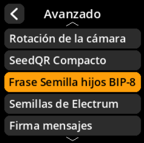

# Frase Semilla hijos BIP-85

Habilite la compatibilidad con la generación de semillas secundarias deterministas BIP-85.

## Proceso paso a paso

1. **Navegar**: Menú principal → **Ajustes** → **Avanzado** → **Frase Semilla hijos BIP-85**
2. **Seleccionar modo**:
     - **Activado** - Compatible con la generación de semillas hijas BIP-85
     - **Desactivado** - Deshabilitar la funcionalidad BIP-85 (predeterminado)

     

     

     

     

