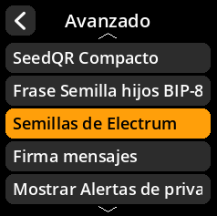

# Semillas de Electrum

Configura la compatibilidad con frases semilla de estilo Electrum.

## Proceso paso a paso

1. **Navegar**: Menú principal → **Ajustes** → **Avanzado** → **Semillas de Electro**
2. **Seleccionar modo**:
     - **Activado** - Compatible con el formato de semilla de Electro
     - **Desactivado** - Solo BIP-39 estándar (predeterminado)

     

     

     

     

