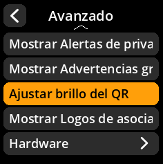

# Consejos de brillo para códigos QR

Administra los consejos de brillo de tus códigos QR directamente desde el menú de configuración.

## Proceso paso a paso

1. **Navegar**: Menú principal → **Ajustes** → **Avanzado** → **Ajustar brillo del QR**
2. **Seleccionar modo de visualización**:
     - **Activado** - Mostrar sugerencias de brillo (predeterminado)
     - **Desactivado** - Ocultar sugerencias de brillo

     

     

     

     

