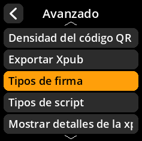

# Configuración de tipos de firma

Configure los tipos de firma compatibles con el dispositivo.

## Proceso paso a paso

1. **Navegar**: Menú principal → **Ajustes** → **Avanzado** → **Tipos de firma**
2. **Seleccionar tipos compatibles**:
     - **Monofirma** - Transacciones con firma única
     - **Multifirma** - Transacciones con múltiples firmas

3. **Configuración predeterminada**: Tanto la firma única como la multifirma están seleccionadas por defecto

     

     

     

     

