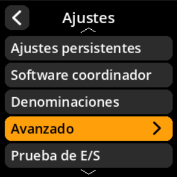

# Inversión de color

Invierte los colores de la pantalla según tus preferencias de visualización o configuraciones de hardware.

## Proceso paso a paso

1. **Navegar**: Menú principal → **Ajustes** → **Avanzado** → **Hardware** → **Invert colors**
2. **Seleccionar modo de color**:
     - **Activado** - Invertir colores de pantalla (predeterminado)
     - **Desactivado** - Pantalla a color estándar

     

     

     

     

     

> **🔧 Solución de problemas**: Ejecute pruebas de hardware si experimenta problemas con la respuesta de los botones, problemas de pantalla o fallos de la cámara. Esto ayuda a identificar problemas de hardware y de software.