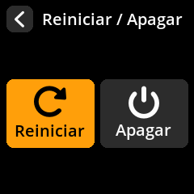

# Reiniciar el dispositivo

1. **Ir al menú de encendido**: Usa el joystick para navegar hasta el **icono de encendido** en la esquina superior derecha de la pantalla de inicio.

    

2. **Abrir opciones de encendido**: Presiona cualquier tecla (A, B o C) para acceder al menú de encendido.

3. **Seleccionar Reiniciar**: Elige **"Reiniciar"** entre las opciones disponibles.

    

4. **Confirmar acción**: El dispositivo se reiniciará y volverá al menú principal.

    

> **🔄Reinicio rápido**: reiniciar borra todos los datos temporales y devuelve el dispositivo a su estado inicial conservando la configuración (si las configuraciones persistentes están habilitadas).
