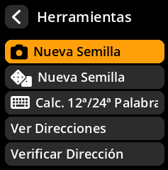
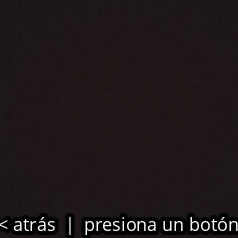
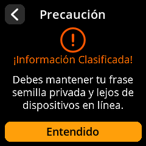
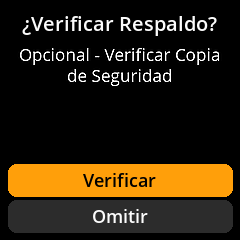

# Generación de Semillas de Cámara

Cree semillas verdaderamente aleatorias utilizando la entropía ambiental capturada por la cámara. Este método proporciona una excelente aleatoriedad al capturar datos visuales impredecibles.

## Proceso completo paso a paso con todas las capturas de pantalla

1. **Navegar**: Menú principal → **Herramientas**

     

2. **Seleccionar método**: Elija **"Nueva semilla"** con el icono de la cámara.

     

3. **Capturar entropía**:
- Apunte la cámara a una escena aleatoria y cambiante (árboles, nubes, etc. en movimiento).
- Pulse cualquier tecla para capturar la entropía.

     

4. **Revisar captura**:
- Mueva el joystick **a la izquierda** para volver a tomar la foto.
- Mueva el joystick **a la derecha** para continuar con la captura actual.

     

5. **Elegir longitud**: Seleccione **12 palabras** o **24 palabras** (se recomiendan 24 palabras para máxima seguridad).

     

6. **Aceptar la advertencia de seguridad**: Haga clic en **"Entiendo"** después de leer la advertencia de información clasificada.

     

7. **Registra tus palabras clave**:
- Las palabras se muestran en grupos de 4.
- **Escribe cada palabra cuidadosamente** en el orden exacto indicado.
- Revisa cada palabra a medida que la escribes.

     

8. **Verifique su copia de seguridad**: Complete el proceso de verificación para confirmar que todo se haya registrado correctamente.

     

> **⚠️ Advertencia de seguridad crítica**: Si escribe mal una sola palabra, podría perder el acceso a sus bitcoins para siempre. El paso de verificación es obligatorio; ¡no lo omita!
