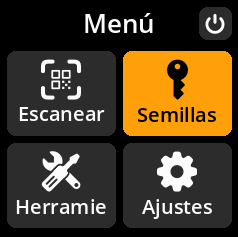
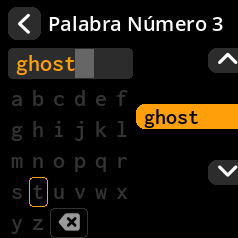

# Entrada manual de semilla

Ingrese su frase mnemotécnica usando el teclado en pantalla.

## Proceso completo paso a paso con todas las capturas de pantalla

1. **Navegar**: Menú principal → **Semillas** → **"Cargar una semilla"**

     

     

2. **Elegir longitud**: Seleccionar **"Introducir semilla de 12 palabras"** o **"Introducir semilla de 24 palabras"**

     

     

3. **Ingresar cada palabra**:
- Usar el teclado en pantalla con sugerencias inteligentes de palabras.
- Escribir las primeras letras y seleccionar entre las sugerencias para una entrada más rápida.
- **Tecla A**: Subir en la lista de sugerencias.
- **Tecla C**: Bajar en la lista de sugerencias.
- **Tecla B**: Seleccionar la palabra sugerida resaltada.

     

4. **Revisar la huella de la semilla**: Verificar el identificador único en la pantalla "Finalizar semilla".

     

5. **Carga completa**:
- Seleccione **"Listo"** para cargar la semilla tal cual.
- O seleccione **"Frase de contraseña BIP-39"** para añadir una capa de seguridad adicional.

> **⚡ Consejo rápido**: La función de sugerencia de palabras agiliza enormemente la entrada. Escriba solo las primeras 2 o 3 letras de cada palabra y seleccione entre las sugerencias filtradas en lugar de escribir cada letra individualmente.