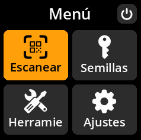

# Escaneo de SeedQR

Cargue semillas de forma rápida y segura desde códigos SeedQR: un formato de código QR compacto diseñado específicamente para frases de semillas.

## Proceso completo paso a paso con todas las capturas de pantalla

1. **Navegar**: Menú principal → **Escanear**

     

2. **Posicionar código QR**: Apunte la cámara a su código SeedQR

     

3. **Esperar reconocimiento**: El dispositivo detectará y procesará automáticamente los códigos SeedQR válidos.

4. **Revisar detalles**: Verifique la información de la semilla en la pantalla "Finalizar semilla"

     

5. **Gestionar errores**: Si ve "Tipo de QR desconocido", el formato del código QR no se reconoce.

     

6. **Finalizar carga**: Seleccione **"Listo"** para cargar la semilla.

> **❌ Solución de problemas**: Si ve "Tipo de QR desconocido", el formato del código QR no se reconoce como un SeedQR válido. Pulse "Listo" para volver al modo de escaneo y verificar que está usando un código SeedQR con el formato correcto.
