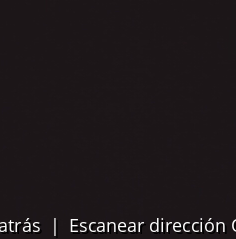

# 🛡️ Verificación y Seguridad

## Verificar la Propiedad de la Dirección

Confirma que una dirección de Bitcoin específica fue generada por tu semilla cargada. Esto es crucial para verificar la legitimidad de las direcciones compartidas contigo.

### Proceso completo paso a paso con todas las capturas de pantalla

1. **Navegar**: Desde la pantalla de inicio → **"Herramientas"** → **"Verificar dirección"**

     

     

     

2. **Ingresar dirección**: Seleccione la dirección de inicio que desea verificar eligiendo una dirección guardada, escaneando una nueva o ingresando manualmente una Frase inicial de 12/24 palabras.

     

3. **Resultados de la revisión**:
- 🔍 **Búsqueda de dirección** - Obtener la dirección de la semilla cargada puede tardar un tiempo.
- ✅ **Dirección encontrada** - La dirección pertenece a tu semilla cargada.

     

     

> **🚨 Caso práctico de seguridad**: Usa esta función para verificar que las direcciones proporcionadas por plataformas de intercambio, comerciantes u otras partes fueron generadas por tu semilla antes de enviar los fondos. Nunca envíes Bitcoin a direcciones no verificadas.
