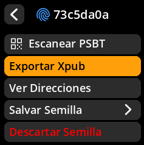
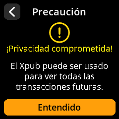
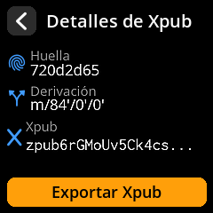

# Exportar clave pública (Xpub)

Crea monederos de solo lectura en tu software de Bitcoin favorito exportando tu clave pública. Esto te permite monitorear saldos y preparar transacciones sin exponer tus claves privadas.

## Proceso completo paso a paso con todas las capturas de pantalla

1. **Acceder a Exportar**: Desde la pantalla principal de la semilla, seleccione **"Exportar Xpub"**

     

2. **Seleccionar el tipo de firma**:
- **"Monofirma"** - Para monederos personales estándar
- **"Multifirma"** - Para monederos multifirma que requieren varios dispositivos

     

3. **Seleccionar el tipo de script**:
- **Native Segwit** (bech32) - Recomendado para las comisiones más bajas
- **Nested Segwit** (P2SH) - Para compatibilidad con sistemas antiguos
- **Taproot** - Para funciones avanzadas de privacidad y contratos inteligentes

     

4. **Elegir el software de billetera**: Seleccione su billetera preferida entre las opciones compatibles

     

5. **Aceptar la advertencia de privacidad**: Pulse **"Entiendo"** después de leer las implicaciones de privacidad de Xpub

     

6. **Generar código QR**: Selecciona **"Exportar XPub"** para mostrar el código QR para compartir.

     

7. **Importar a la billetera**: Escanea el código QR con el software de billetera que elijas.

     

> **🔒 Advertencia de privacidad**: Tu XPub (clave pública extendida) revela todas tus direcciones de Bitcoin e historial de transacciones. Compártela únicamente con un software de billetera de confianza y nunca la publiques en línea.
