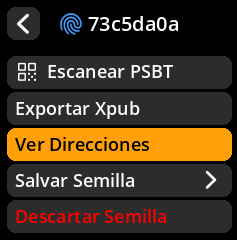
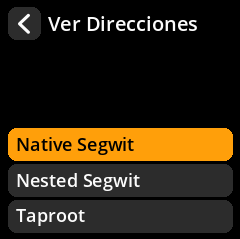

# Generar direcciones de cambio

Ver las direcciones utilizadas para la devolución de cambios de transacciones

## Proceso paso a paso con capturas de pantalla

**Ruta de navegación**: Inicio → Semillas → [Seleccionar semilla] → Ver Direccions`

     

     

     

**Flujo del proceso**:

1. **Selección del tipo de script** → Elija su dirección preferida Formato

     

2. **Acceso a cambios** → Seleccione "Cambiar dirección" en lugar de recibir

     

3. **Administración de direcciones** → Explorar direcciones de cambio (paginado: 10 por vista)

     

4. **Acceso a código QR** → Toque cualquier dirección para ver el código QR

     

#### Información clave

**Tipos de direcciones disponibles**:

- Native Segwit (recomendado)
- Nested Segwit (compatibilidad)
- Taproot (funciones avanzadas)

**Práctica recomendada de privacidad**: Use una nueva dirección de recepción para cada transacción

**Nota técnica**: Las direcciones de cambio gestionan automáticamente los fondos restantes de la transacción

>**💡 Práctica recomendada**: Las direcciones de cambio son gestionadas automáticamente por su billetera; normalmente no necesita generarlas ni compartirlas manualmente.
