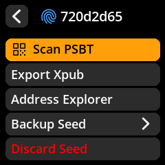
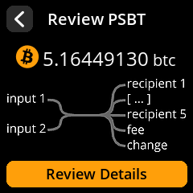
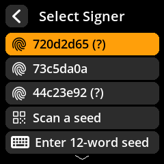
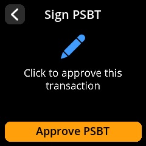

# ✍️ Sign Bitcoin Transaction (PSBT)

Securely approve and sign Bitcoin transactions created by your wallet software. PSBT (Partially Signed Bitcoin Transaction) is the standard format for unsigned transactions.

## Complete Step-by-Step Process with All Screenshots

1. **Access Signing**: From your seed's main screen, select **"Scan PSBT"**

     

2. **Scan Transaction QR**: Point the camera at the transaction QR code generated by your wallet software

     

3. **Review Transaction Details**: Carefully verify ALL information displayed

     

   **Critical Items to Verify:**

- ✅ **Recipient address** - Confirm this matches your intended destination
- ✅ **Amount being sent** - Verify the exact Bitcoin amount
- ✅ **Transaction fee** - Check that the fee is reasonable
- ✅ **Change address** - Ensure change returns to your wallet

4. **Select Signing Seed**: Choose the appropriate seed if multiple are loaded

     

5. **Authorize Signing**: Confirm you want to sign this transaction

     

6. **Broadcast Transaction**: Scan the resulting signed QR code back into your wallet software
7. **Confirm Broadcast**: Your wallet will broadcast the transaction to the Bitcoin network

> **🚨 Critical Security Check**: Bitcoin transactions are irreversible once broadcast to the network. ALWAYS verify the recipient address and amount before signing. Double-check that the recipient address matches your intended destination exactly.
