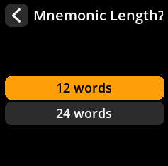

# Camera-Based Seed Generation

Create truly random seeds using environmental entropy captured by the camera. This method provides excellent randomness by capturing unpredictable visual data.

## Complete Step-by-Step Process with All Screenshots

1. **Navigate**: Main Menu → **Tools**

     

2. **Select Method**: Choose **"New Seed"** with the camera icon

     

3. **Capture Entropy**:
   - Point the camera at a random, changing scene (moving trees, clouds, etc.)
   - Press any key to capture the entropy

     

4. **Review Capture**:
   - Move joystick **left** to retake the photo
   - Move joystick **right** to continue with current capture

     

5. **Choose Length**: Select **12 words** or **24 words** (24 words recommended for maximum security)

     

6. **Acknowledge Security Warning**: Press **"I Understand"** after reading the classified information warning

     

7. **Record Your Seed Words**:
   - Words are displayed 4 at a time
   - **Write down every word carefully** in the exact order shown
   - Double-check each word as you write it

     

8. **Verify Your Backup**: Complete the verification process to confirm you've recorded everything correctly

     

> **⚠️ Critical Security Warning**: If you write down even one word incorrectly, you could lose access to your Bitcoin forever. The verification step is mandatory - never skip it!