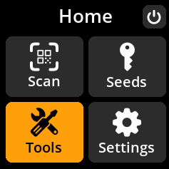
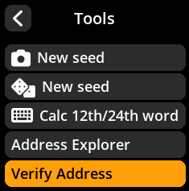
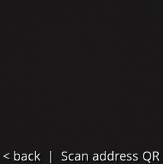
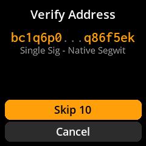

# 🛡️ Verification and Security

## Verify Address Ownership

Confirm that a specific Bitcoin receive address was **actually generated by the seed loaded on your SeedSigner device**. This verification helps ensure that the addresses produced by your software wallet (e.g., Sparrow Wallet) **match** those derived from your air-gapped seed on SeedSigner, protecting you against wallet misconfiguration, malware, or tampering.

**Important:** This feature only verifies Bitcoin addresses derived from your own seed. It **cannot** be used to verify addresses owned by exchanges, merchants, or other third parties.

### Recommended Placement

This section is ideally located immediately following the "Export Public Key" step, since verifying generated receive addresses is the natural next step to confirm that the linked software wallet is working securely.

### Step-by-Step Instructions

1. **Navigate to Verify Address**

   From the SeedSigner Home screen:  
   → Select **Tools**  
   → Select **Verify Address**

   

       
   

   

       
   

   

       
   

2. **Enter Address to Verify**

   - **Primary workflow:** Scan a Bitcoin receive address from your software wallet (such as Sparrow or BlueWallet) that you want to verify.
   - **Optional (advanced):** You may also choose to load a saved seed, scan a new seed, or manually enter your 12/24-word seed phrase to verify addresses from it. However, these are less common workflows and intended for advanced users.

   

       
   

3. **Verification Process**

   - SeedSigner will search through the addresses derived from your loaded seed to find a match.
   - This may take some time depending on the address index range and seed complexity.

4. **Review the Results**

   - 🔍 **Address Searching:** Deriving address from loaded seed — may take time.
   - ✅ **Address Found:** The address belongs to your loaded seed.

   

       
   

   

       
   

---

### 🚨 Security Use Case

Use this feature to **confirm that a receive address produced by your software wallet truly matches one generated from your offline seed held in SeedSigner**. This verification protects you from:

- Software wallet misconfigurations.
- Malware or manipulation that might replace your receive address with an attacker’s.
- Mistakes before sending or receiving Bitcoin.

**Never send Bitcoin to an unverified address.**

---

### Summary & Tips

| Key Point                       | Explanation                                                                                                                        |
| ------------------------------- | ---------------------------------------------------------------------------------------------------------------------------------- |
| What SeedSigner verifies        | If a Bitcoin address is derived from your loaded seed, no matter where the seed was created.                                       |
| What SeedSigner does NOT verify | Ownership or authenticity of addresses from exchanges, merchants, or third parties.                                                |
| Typical use case                | Check that a receive address shown in your software wallet (e.g., Sparrow) matches the same derived on SeedSigner using your seed. |
| Why this matters                | To ensure you control the private keys and are not sending/receiving funds to compromised or incorrect addresses.                  |

---

### Notes for New Users

- The feature is designed for **matching** addresses derived from your seed, not “verifying” addresses owned by others.
- Loading or entering an entire seed is possible but advanced and usually not necessary if you already have your seed loaded on SeedSigner.
- Always verify your addresses before receiving funds to maintain full self-custody security.
