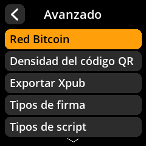

# Selección de la red Bitcoin

Seleccione la red Bitcoin que desea usar para direcciones y transacciones.

## Proceso paso a paso

1. **Navegar**: Menú principal → **Ajustes** → **Avanzado** → **Red Bitcoin**
2. **Seleccionar red**:
     - **Mainnet** - Red Bitcoin real (predeterminada para uso normal)
     - **Testnet** - Red de pruebas para desarrollo y experimentación
     - **Regtest** - Red de pruebas de regresión local

     

     

     

     

> **⚠️ Advertencia de red**: Asegúrate siempre de usar la red principal para transacciones reales de Bitcoin. La red de prueba y el registro son solo para fines de desarrollo.
