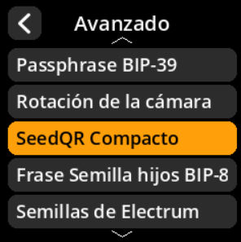

# Compact SeedQR

Configure la compresión de SeedQR para códigos QR más eficientes.

## Proceso paso a paso

1. **Navegar**: Menú principal → **Ajustes** → **Avanzado** → **SeedQR Compacto**
2. **Seleccionar modo**:
     - **Activado** - Usar formato compacto de SeedQR (predeterminado)
     - **Desactivado** - Usar formato estándar de SeedQR

     

     

     

     

