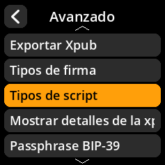

# Configuración de tipos de scripts

Defina los tipos de scripts de Bitcoin compatibles con el dispositivo.

## Proceso paso a paso

1. **Navegar**: Menú principal → **Ajustes** → **Avanzado** → **Tipos de script**
2. **Seleccionar scripts compatibles**:
     - **Native Segwit** - Direcciones P2WPKH (habilitado por defecto)
     - **Nested Segwit** - Segwit con encapsulado P2SH (habilitado por defecto)
     - **Legacy** - Direcciones P2PKH
     - **Taproot** - Direcciones P2TR (habilitado por defecto)
     - **Custom Derivation** - Rutas de derivación personalizadas

     

     

     

     

