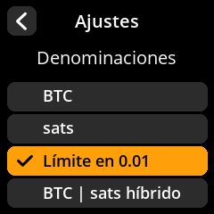

# Visualización de la denominación

Configure cómo se muestran las cantidades de Bitcoin en el dispositivo.

## Proceso paso a paso

1. **Navegar**: Menú principal → **Ajustes** → **Denominaciones**
2. **Seleccionar formato de visualización**: Elija el formato de denominación que prefiera entre las opciones disponibles
3. **Configuración predeterminada**: El umbral predeterminado es 0,01

     

     

     

