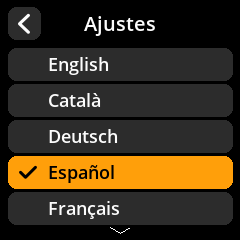

# Configuración de idioma

Configure su idioma preferido para la interfaz de SeedSigner.

## Proceso paso a paso

1. **Navegar**: Menú principal → **Ajustes** → **Idioma**
2. **Seleccionar idioma**: Elige tu idioma preferido entre las opciones disponibles
3. **Confirmar selección**: La interfaz se actualizará para usar el idioma seleccionado

     

     

     

