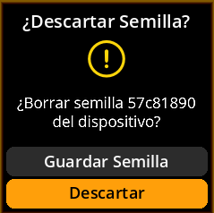

# Descartar la semilla cargada

Elimine de forma segura la semilla actual de la memoria al finalizar sus operaciones.

## Proceso completo paso a paso con todas las capturas de pantalla

1. **Navegar**: `Inicio → Semillas → [Seleccionar semilla] → Descartar semilla`

     

     

     

2. **Confirmar descarte**: Seleccione **"Descartar"** para eliminar la semilla de la memoria

     

3. **Volver al menú principal**: Volverás al menú principal sin semillas cargadas.

     

> **🧹 Borrado de memoria**: Descartar una semilla la elimina por completo de la memoria del dispositivo. Esta es una práctica recomendada de seguridad al cambiar entre diferentes semillas o al finalizar operaciones.
