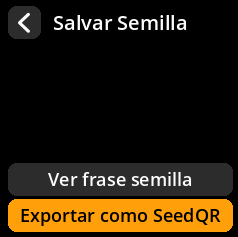
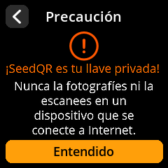
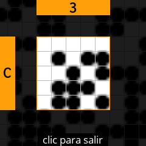
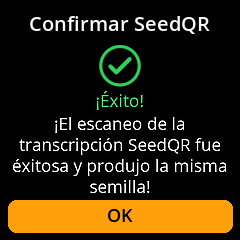

# Crear copia de seguridad de SeedQR

Genere copias de seguridad compactas de su frase inicial con código QR para un almacenamiento y recuperación fáciles.

## Proceso completo paso a paso con capturas de pantalla

1. **Navegar**: `Inicio → Semillas → [Seleccionar Semilla] → Salvar Semilla → Exportar como SeedQR`

     

     

     

     

2. **Elegir formato**:
     - **"Estándar: 25x25"** - Más grande, más fácil de escanear
     - **"Compacto: 21x21"** - Más pequeño, requiere un escaneo más preciso

     

3. **Aceptar advertencia**: Confirme que comprende que SeedQR contiene su clave privada completa

     

4. **Revisar QR completo**: Vea el código QR completo y seleccione **"Empezar"** para examinarlo ampliado Secciones

     

5. **Navegar por todas las secciones**: Use el joystick para revisar cada parte del código QR y comprobar su precisión.

     

6. **Revisión completa**: Pulse cualquier tecla para continuar. Verás dos opciones:
     - **"Confirmar SeedQR"** - Verificar que el código QR generado sea correcto
     - **"Finalizar"** - Volver a la pantalla principal de Seeds

     

**Si seleccionas "Confirmar SeedQR":**

- La cámara del dispositivo se abrirá para escanear el código QR transcrito
- Mostrar la imagen del QR transcrito a la cámara para su verificación
- El sistema confirmará si se capturó la imagen correcta

     

**Mensaje de éxito:**

     

**Mensaje de error:**

     

**Si selecciona "Finalizar":**

- Será redirigido a la pantalla principal de Seeds.

     

> **⚠️ Equivalente de seguridad**: Los códigos SeedQR son funcionalmente equivalentes a su copia de seguridad de Seed. Guárdelos con las mismas medidas de seguridad: en cajas fuertes ignífugas, cajas de seguridad u otros lugares seguros.
