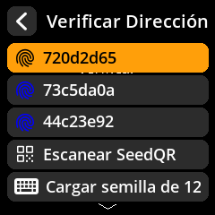

# 🛡️ Verificación y Seguridad

## Verificar la Propiedad de la Dirección

Confirme que una dirección de recepción de Bitcoin específica fue **generada por la semilla cargada en su dispositivo SeedSigner**. Esta verificación ayuda a garantizar que las direcciones generadas por su monedero virtual (por ejemplo, Sparrow Wallet) **coincidan** con las derivadas de su semilla aislada en SeedSigner, lo que le protege contra errores de configuración, malware o manipulación.

**Importante:** Esta función solo verifica las direcciones de Bitcoin derivadas de su propia semilla. **No se puede** utilizar para verificar direcciones propiedad de exchanges, comerciantes u otros terceros.

### Ubicación Recomendada

Esta sección se ubica idealmente justo después del paso "Exportar Clave Pública", ya que verificar las direcciones de recepción generadas es el siguiente paso natural para confirmar que el monedero virtual vinculado funciona de forma segura.

### Instrucciones paso a paso

1. **Vaya a Verificar dirección**

Desde la pantalla de inicio de SeedSigner:
→ Seleccione **Herramientas**
→ Seleccione **Verificar dirección**

    

    

    

2. **Ingrese la dirección a verificar**
     - **Flujo de trabajo principal:** Escanee una dirección de recepción de Bitcoin desde su Monedero de software (como Sparrow o BlueWallet) que desea verificar.
     - **Opcional (avanzado):** También puede cargar una semilla guardada, escanear una nueva semilla o ingresar manualmente su frase semilla de 12 o 24 palabras para verificar las direcciones. Sin embargo, estos son flujos de trabajo menos comunes y están pensados para usuarios avanzados.

     

3. **Proceso de verificación**
     - SeedSigner buscará entre las direcciones derivadas de su semilla cargada para encontrar una coincidencia.
     - Esto puede tardar un tiempo, dependiendo del rango del índice de direcciones y la complejidad de la semilla.

4. **Revisar los resultados**
     - 🔍 **Búsqueda de dirección:** Obtener la dirección de la semilla cargada puede tardar un tiempo.
     - ✅ **Dirección encontrada:** La dirección pertenece a su semilla cargada.

     

     

---

### 🚨 Caso de uso de seguridad

Utilice esta función para **confirmar que la dirección de recepción generada por su monedero de software coincida realmente con la generada a partir de su semilla sin conexión almacenada en SeedSigner**. Esta verificación le protege de:

- Configuraciones incorrectas del monedero de software.
- Malware o manipulación que pueda reemplazar su dirección de recepción con la de un atacante.
- Errores antes de enviar o recibir Bitcoin.

**Nunca envíe Bitcoin a una dirección no verificada.**

---

### Resumen y consejos

| Punto clave | Explicación |
| ------------------------------- | ---------------------------------------------------------------------------------------------------------------------------------- |
| Qué verifica SeedSigner | Si una dirección de Bitcoin se deriva de tu semilla cargada, independientemente de dónde se creó. |
| Qué NO verifica SeedSigner | Propiedad o autenticidad de direcciones de exchanges, comerciantes o terceros. |
| Caso de uso típico | Verifica que la dirección de recepción que aparece en tu monedero de software (por ejemplo, Sparrow) coincida con la misma derivada en SeedSigner que usa tu semilla. |
| Por qué esto es importante | Para asegurarte de que controlas las claves privadas y no envías ni recibes fondos a direcciones comprometidas o incorrectas. |

---

### Notas para nuevos usuarios

- Esta función está diseñada para **coincidir** con direcciones derivadas de tu semilla, no para "verificar" direcciones propiedad de otros.
- Cargar o ingresar una semilla completa es posible, pero es una opción avanzada y, por lo general, no es necesario si ya la tienes cargada en SeedSigner. - Verifique siempre sus direcciones antes de recibir fondos para mantener la seguridad de autocustodia total.
