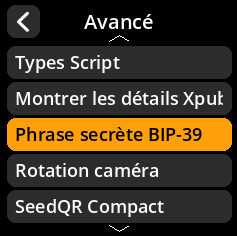
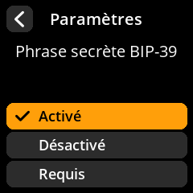

# Configuration de la phrase secrète BIP-39

Contrôlez la façon dont l'appareil gère les phrases secrètes BIP-39.

## Procédure étape par étape

1. **Naviguer** : Paramètres → **Avancé** → **Phrase secrète BIP-39**
2. **Choisir le mode** :
     - **Activé** - La phrase secrète est facultative (paramètre par défaut recommandé)
     - **Désactivé** - Aucune phrase secrète prise en charge
     - **Requis** - Chaque seed doit avoir une phrase secrète

     

     

     

     

