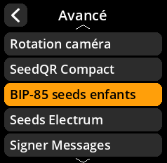
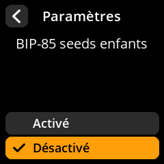

# BIP-85 seeds enfants

Activer la prise en charge de la génération de graines enfants déterministes BIP-85.

## Procédure étape par étape

1. **Naviguer** : Paramètres → **Avancé** → **BIP-85 seeds enfants**
2. **Choisir le mode** :
     - **Activé** : Prise en charge de la génération de graines enfants BIP-85
     - **Désactivé** : Désactiver la fonctionnalité BIP-85 (par défaut)

     

     

     

     

