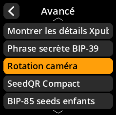
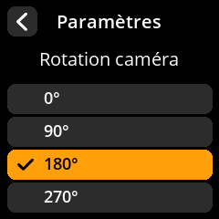

# Rotation caméra

Ajustez l'orientation de la caméra en fonction de la configuration de votre appareil.

## Procédure étape par étape

1. **Naviguer** : Paramètres → **Avancé** → **Rotation caméra**
2. **Sélectionner la rotation** :
     - **0 degré** - Aucune rotation
     - **90 degrés** - Quart de tour dans le sens horaire
     - **180 degrés** - À l'envers (par défaut pour la plupart des configurations)
     - **270 degrés** - Quart de tour dans le sens antihoraire

     

     

     

     

