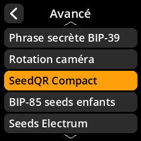
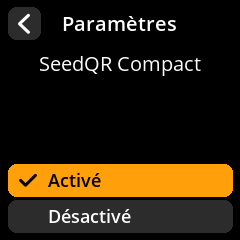

# SeedQR compact

Configurez les paramètres de compression de SeedQR pour des codes QR plus efficaces.

## Procédure étape par étape

1. **Naviguer** : Paramètres → **Avancé** → **SeedQR compact**
2. **Choisir le mode** :
     - **Activé** - Utiliser le format SeedQR compact (par défaut)
     - **Désactivé** - Utiliser le format SeedQR standard

     

     

     

     

