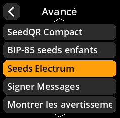
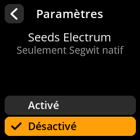

# Seeds Electrum

Configurer la prise en charge des phrases de type « seeds » Electrum.

## Procédure étape par étape

1. **Naviguer** : Paramètres → **Avancé** → **Seeds Electrum**
2. **Choisir le mode** :
     - **Activé** - Prise en charge du format de données Electrum
     - **Désactivé** - Standard BIP-39 uniquement (par défaut)

     

     

     

     

