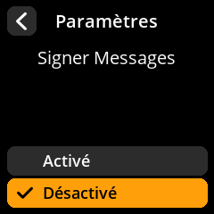

# Signer Messages

Activer la fonctionnalité de signature cryptographique des messages.

## Procédure étape par étape

1. **Naviguer** : Paramètres → **Avancé** → **Signer Messages**
2. **Choisir le mode** :
     - **Activé** : Autoriser la signature des messages
     - **Désactivé** : Désactiver la signature des messages (par défaut)

     

     

     

     

