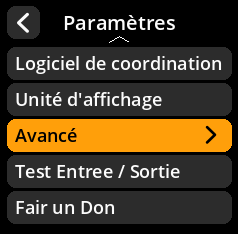

# Logos des partenaires

Contrôlez l'affichage des logos des partenaires et des fournisseurs de portefeuilles.

## Procédure étape par étape

1. **Naviguer** : Paramètres → **Avancé** → **Montrer les logos partenaires**
2. **Choisir le mode d'affichage** :
     - **Activé** - Montrer les logos partenaires (par défaut)
     - **Désactivé** - Masquer les logos des partenaires

     

     

     

     

