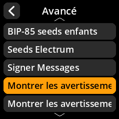
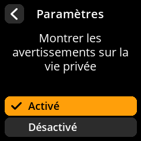

# Avertissements de confidentialité

Contrôlez l'affichage des avertissements et notifications relatifs à la confidentialité.

## Procédure étape par étape

1. **Naviguer** : Paramètres → **Avancé** → **Montrer les avertissements sur la vie privée**
2. **Choisir le mode d'affichage** :
     - **Activé** - Montrer les avertissements sur la vie privée (par défaut)
     - **Désactivé** - Masquer les avertissements de confidentialité

     

     

     

     

