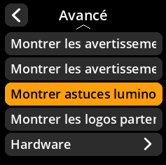
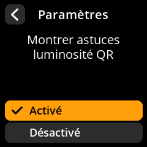

# Conseils de luminosité des codes QR

Gérez les conseils de luminosité des codes QR directement depuis le menu des paramètres.

## Procédure étape par étape

1. **Naviguer** : Paramètres → **Avancé** → **Montrer astuces luminosité QR**
2. **Choisir le mode d'affichage** :
     - **Activé** - Afficher les conseils de luminosité (par défaut)
     - **Désactivé** - Masquer les conseils de luminosité

     

     

     

     

