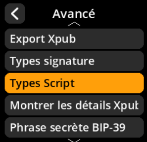
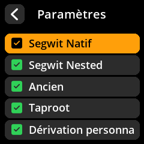

# Configuration des types de scripts

Définissez les types de scripts Bitcoin pris en charge sur l'appareil.

## Procédure étape par étape

1. **Naviguer** : Paramètres → **Avancé** → **Types Script**
2. **Sélectionner les scripts pris en charge** :
     - **Segwit Natif** - Adresses P2WPKH (activé par défaut)
     - **Segwit Nested** - Segwit encapsulé P2SH (activé par défaut)
     - **Ancien** - Adresses P2PKH
     - **Taproot** - Adresses P2TR (activé par défaut)
     - **Dérivation personnalisée** - Chemins de dérivation personnalisés

     

     

     

     

