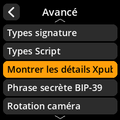

# Montrer les détails Xpub

Contrôlez l'affichage des détails de la clé publique étendue.

## Procédure étape par étape

1. **Naviguer** : Paramètres → **Avancé** → **Montrer les détails XPub**
2. **Choisir le mode d'affichage** :
     - **Activé** : Montrer les informations XPub détaillées (par défaut)
     - **Désactivé** : Masquer les détails XPub

     

     

     

     

