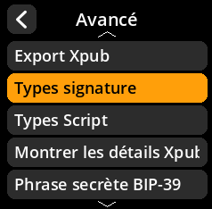
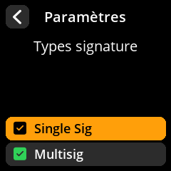

# Configuration des types de signature

Configurez les types de signature pris en charge par l'appareil.

## Procédure étape par étape

1. **Naviguer** : Paramètres → **Avancé** → **Types signature**
2. **Sélectionner les types pris en charge** :
     - **Single sig** : Transactions à signature unique
     - **Multisig** : Transactions multisignatures
3. **Paramètre par défaut** : Les single sig et multisig sont sélectionnées par défaut.

     

     

     

     

