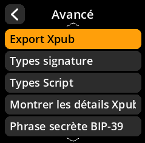
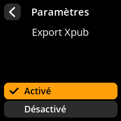

# Configuration d'exportation Xpub

Contrôlez la fonctionnalité étendue d'exportation de clés publiques.

## Procédure étape par étape

1. **Naviguer** : Paramètres → **Avancé** → **Export Xpub**
2. **Choisir le mode** :
     - **Activé** : Autoriser l'exportation XPub (par défaut)
     - **Désactivé** : Désactiver la fonctionnalité d'exportation XPub

     

     

     

     

