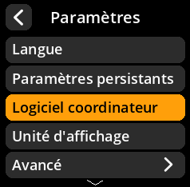
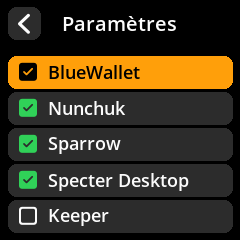

# Support logiciel coordinateur

Activez ou désactivez la prise en charge d'applications de portefeuille spécifiques. Cela permet de personnaliser les formats et la compatibilité des codes QR.

## Procédure étape par étape

1. **Naviguer** : Menu principal → **Paramètres** → **Logiciel coordinateur**
2. **Configurer la prise en charge** pour chaque portefeuille :
     - ✅ **BlueWallet** - Portefeuille Bitcoin mobile
     - ✅ **Nunchuk** - Portefeuille collaboratif
     - ✅ **Sparrow Wallet** - Portefeuille Bitcoin de bureau
     - ✅ **Specter Desktop** - Portefeuille axé sur la confidentialité
     - ✅ **Keeper** - Portefeuille de planification successorale

     

     

     

