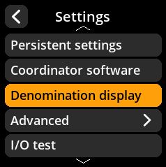
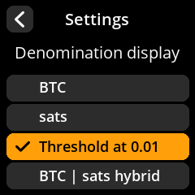

# Denomination Display

Configure how Bitcoin amounts are displayed on the device.

## Step-by-Step Process

1. **Navigate**: Main Menu → **Settings** → **Denomination Display**
2. **Select Display Format**: Choose your preferred denomination format from available options
3. **Default Setting**: Threshold at 0.01 is selected by default

     

     

     

