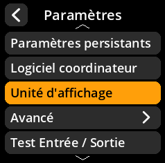
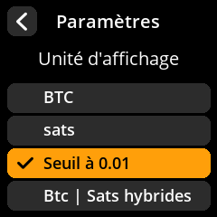

# Unité d'affichage

Configurez l'affichage des montants en Bitcoins sur l'appareil.

## Procédure étape par étape

1. **Naviguer** : Menu principal → **Paramètres** → **Unité d'affichage**
2. **Sélectionner le format d'affichage** : Choisissez votre format de valeur nominale préféré parmi les options disponibles.
3. **Paramètre par défaut** : Seuil en 0.01 est sélectionné par défaut.

     

     

     

