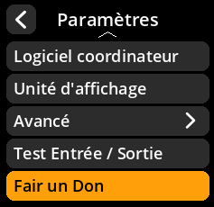

# Informations sur les dons

Accédez aux informations sur les dons pour soutenir le développement de SeedSigner.

## Procédure étape par étape

1. **Naviguer** : Menu principal → **Paramètres** → **Fair un Don**
2. **Voir les détails** : Consultez les informations et les adresses de don
3. **Soutenir le développement** : Envisagez de contribuer au projet

     

     

     

