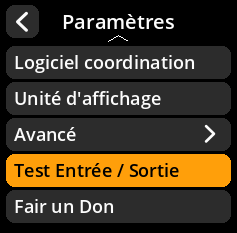
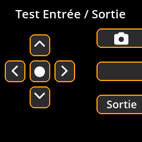

# Test Entrée / Sortie matérielles

Vérifiez le bon fonctionnement de tous les composants de l'appareil.

## Procédure étape par étape

1. **Naviguer** : Menu principal → **Paramètres** → **Test Entrée / Sortie**
2. **Tester les contrôleurs** : Utilisez cet écran pour tester les fonctionnalités d'entrée/sortie de votre appareil.
3. **Vérifier les composants** : Assurez-vous que tous les boutons, l'écran et l'appareil photo fonctionnent correctement.

     

     

     

