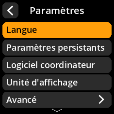
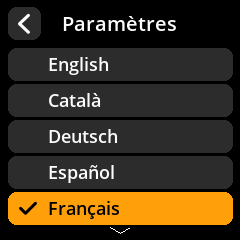

# Configuration de la langue

Définissez votre langue préférée pour l'interface SeedSigner.

## Procédure étape par étape

1. **Naviguer** : Menu principal → **Paramètres** → **Langue**
2. **Sélectionner la langue** : Choisissez votre langue préférée parmi les options disponibles
3. **Confirmer la sélection** : L'interface se mettra à jour pour utiliser la langue sélectionnée

     

     

     

