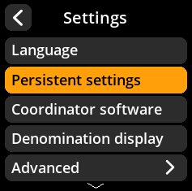
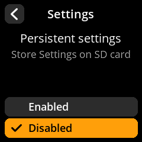

# Persistent Settings

Configure whether your settings are saved permanently or reset on each boot.

## Step-by-Step Process

1. **Navigate**: Main Menu → **Settings** → **Persistent Settings**  
2. **Choose Mode**:
   - **"Enabled"** - Saves settings to SD card (survives reboots)
   - **"Disabled"** - Temporary settings only (resets on power cycle)

     

     

     

> **🔒 Security Consideration**: Enabled persistent settings provide convenience but store configuration data on the SD card. Disabled persistent settings provide maximum security but require reconfiguring preferences after each boot.
