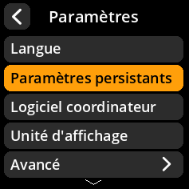
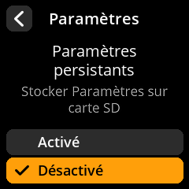

# Paramètres persistants

Configurez si vos paramètres sont enregistrés de manière permanente ou réinitialisés à chaque démarrage.

## Procédure étape par étape

1. **Naviguer** : Menu principal → **Paramètres** → **Paramètres persistants**
2. **Choisir le mode** :
     - **Activé** : Enregistre les paramètres sur la carte SD (résiste aux redémarrages)
     - **Désactivé** : Paramètres temporaires uniquement (réinitialisés lors d'un redémarrage)

     

     

     

> **🔒 Considérations de sécurité** : L'activation des paramètres persistants est pratique, mais stocke les données de configuration sur la carte SD. La désactivation des paramètres persistants offre une sécurité maximale, mais nécessite une reconfiguration des préférences après chaque démarrage.
