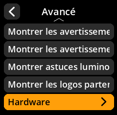

# Inversion des couleurs

Inversez les couleurs d'affichage selon vos préférences d'affichage ou configurations matérielles.

## Procédure étape par étape

1. **Naviguer** : Paramètres → **Avancé** → **Hardware** → **Invert Colors**
2. **Choisir le mode couleur** :
     - **Activé** - Invert colors d'affichage (par défaut)
     - **Désactivé** - Affichage couleur standard

     

     

     

     

     

> **🔧 Dépannage** : Exécutez des tests matériels si vous rencontrez des problèmes de réponse des boutons, d'affichage ou de dysfonctionnement de l'appareil photo. Cela permet d'isoler les problèmes matériels des problèmes logiciels.
