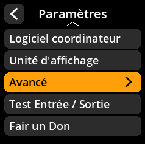
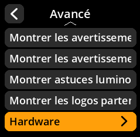
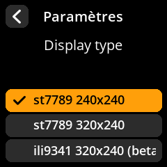

# Configuration du type d'affichage

Configurez le pilote d'affichage en fonction de votre configuration matérielle.

## Procédure étape par étape

1. **Naviguer** : Paramètres → **Avancé** → **Hardware** → **Display Type**
2. **Sélectionner le pilote d'affichage** :
     - **st7789 240x240** - Affichage carré standard (par défaut)
     - **st7789 320x240** - Affichage rectangulaire
     - **ili9341 320x240 (bêta)** - Pilote d'affichage alternatif (bêta)

     

     

     

     

     

