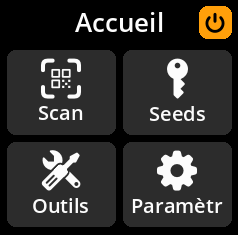

# Mise hors tension en toute sécurité

## Méthode 1 : Arrêt correct

1. Accédez à l'**icône d'alimentation** (en haut à droite du menu principal)

     

2. Appuyez sur n'importe quelle touche pour ouvrir le menu d'alimentation.

     

3. Sélectionnez **« Éteindre »** et confirmez votre choix.

     

## Méthode 2 : Débranchement direct

Vous pouvez débrancher l'appareil en toute sécurité à tout moment. SeedSigner ne stocke rien de manière permanente, donc toutes les données sensibles sont automatiquement effacées lorsque l'alimentation est coupée.
