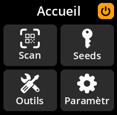
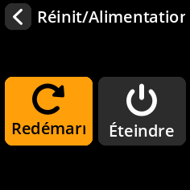

# Redémarrer votre appareil

1. **Accéder au menu d'alimentation** : Utilisez le joystick pour accéder à l'**icône d'alimentation** en haut à droite de l'écran d'accueil.

     

2. **Ouvrir les options d'alimentation** : Appuyez sur n'importe quelle touche (A, B ou C) pour accéder au menu d'alimentation.

3. **Sélectionner Redémarrer** : Choisissez **« Redémarrer »** parmi les options disponibles.

     

4. **Confirmer l'action** : L'appareil redémarre et revient au menu principal.

     

> **🔄 Réinitialisation rapide** : Le redémarrage efface toutes les données temporaires et rétablit l'état initial de l'appareil tout en préservant vos paramètres configurés (si les paramètres persistants sont activés).
