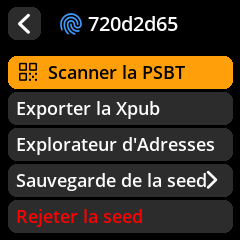
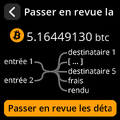
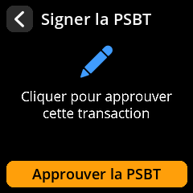

# ✍️ Signature de transaction Bitcoin (PSBT)

Approuvez et signez en toute sécurité les transactions Bitcoin créées par votre logiciel de portefeuille. PSBT (Partially Signed Bitcoin Transaction) est le format standard pour les transactions non signées.

## Procédure complète étape par étape avec captures d'écran

1. **Signature d'accès** : Depuis l'écran principal de votre seed, sélectionnez **« Scanner la PSBT »**

     

2. **Scanner le QR de la transaction** : Dirigez l'appareil photo vers le QR code de transaction généré par votre logiciel de portefeuille.

     

3. **Vérifier les détails de la transaction** : Vérifiez attentivement toutes les informations affichées.

     

**Éléments essentiels à vérifier** :

- ✅ **Adresse du destinataire** - Confirmez qu'elle correspond à votre destination
- ✅ **Montant envoyé** - Vérifiez le montant exact en Bitcoins
- ✅ **Frais de transaction** - Vérifiez que les frais sont raisonnables
- ✅ **Changement d'adresse** - Assurez-vous que la monnaie est bien dans votre portefeuille

4. **Sélectionner la graine de signature** : Choisissez la graine appropriée si plusieurs sont chargées

     

5. **Autoriser la signature** : Confirmez que vous souhaitez signer cette transaction

     

6. **Transmission diffusée** : Scannez le code QR signé obtenu dans votre logiciel de portefeuille.

7. **Confirmer la diffusion** : Votre portefeuille diffusera la transaction sur le réseau Bitcoin.

> **🚨 Vérification de sécurité critique** : Les transactions Bitcoin sont irréversibles une fois diffusées sur le réseau. Vérifiez TOUJOURS l'adresse du destinataire et le montant avant de signer. Vérifiez que l'adresse du destinataire correspond exactement à la destination prévue.
